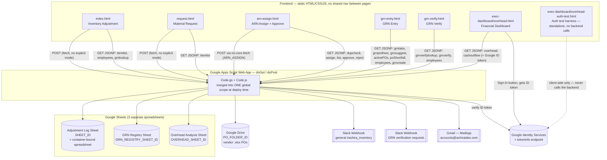

# Architecture

## High-level shape



## Frontend pages and navigation

There is **no shared navigation** between pages — no header links, no menu, no
router. Confirmed by grep: no `<a href="...html">` exists anywhere in
`frontend/`. Each page is an **independent entry point**, reached by:
- a bookmark / home-screen shortcut (mobile-first responsive design on all
  pages strongly suggests phone use on the shop floor),
- the printed QR code (`Achira_Inventory_QR.png`) — presumably pointing at
  `index.html`, the store manager's primary tool,
- a Slack DM link with `?tab=...&grn=...` query params, generated by the
  backend (`grn-verify.html`, sent via `notifyGrnForVerification`),
- direct URL entry for the exec dashboard.

This means: there is no "app shell." Every page duplicates its own header,
CSS design tokens, JSONP helper, and (in two cases) its own hardcoded copy of
the employee directory. See `KNOWN_ISSUES.md` for the consequences.

## User roles (inferred from UI/business logic, not an enforced permission system)

| Role | Pages used | How "identity" is established |
|---|---|---|
| Store Manager | `index.html`, `arn-assign.html` (Approve tab) | Picks their name from a fixed 3-person `<select>` (`Shiva Raj`, `Raghavendra Katti`, `Siddharth R`) in `index.html`; free-text/dropdown name elsewhere — **never verified** |
| Any employee | `request.html`, `arn-assign.html` (New Item tab) | Picks dept then name from a hardcoded JS object — **never verified** |
| Procurement / Stores | `grn-entry.html` | No identity capture at all for the submitter; "Received By"/"Requested By" are free-text/datalist fields |
| Requester | `grn-verify.html` | Types their name into a free-text field — **never verified against who the GRN says requested it** |
| Executive | `exec-dashboard/overhead.html` | **Real auth**: Google Sign-In → ID token → server verifies signature+audience via Google's `tokeninfo` endpoint → checks email against a 4-address allowlist (`OVERHEAD_ALLOWED_EMAILS`) |

Everywhere except the exec dashboard, "who did this" is a client-supplied
string with no cryptographic or session-based backing. `arnApprove`/`arnReject`
do compare `data.person`/`data.personDept` against the row's `requestedBy`/
`Requester Dept` before allowing an approval — but since `data.person` is just
whatever the caller's HTTP request says, this is an authorization check with
no authentication underneath it (see `KNOWN_ISSUES.md`).

## Backend: one Apps Script project, two source files

`doGet(e)` and `doPost(e)` are the only two entry points Apps Script Web Apps
support. All backend behavior is a big `if/else` chain in each, keyed off
`e.parameter.action` (GET) or `data.type` (POST). See `BACKEND_FLOW.md` for
the full routing table.

Both `Code.gs` and `Code.js` define `doGet`/`doPost`/etc. `.clasp.json` pushes
**both** files into the same Apps Script project (`scriptExtensions: [".js",
".gs"]`). Apps Script concatenates every script file in a project into one
global scope; when two files declare the same top-level `function` name, the
one that loads **last** silently wins — there is no error, no warning. Which
file "wins" depends on Apps Script's internal file ordering, not something
visible in this repo. This is the most important architectural risk in the
system; see `KNOWN_ISSUES.md` §1.

## Data flow: UI → Sheet → UI

Two transport patterns are used, chosen per call for CORS reasons (Apps
Script Web Apps don't send `Access-Control-Allow-Origin` headers on POST
responses, and inconsistently on GET):

1. **Writes (POST)** — the frontend serializes a JS object to JSON, puts it
   in a `data` field of a `URLSearchParams` body, and POSTs to the Web App
   URL. `doPost` parses it and routes on `data.type`. Response handling is
   inconsistent across pages — see `KNOWN_ISSUES.md` §2.
2. **Reads (and some writes) via JSONP** — the frontend injects a `<script
   src="...?action=X&callback=cbName">` tag; the backend detects
   `e.parameter.callback` and wraps its JSON response in
   `callbackName(...)`, executed as the script loads. This is how every GET
   read happens, and also how `arn-assign.html` and `grn-entry.html` submit
   some writes (`assign`, `grncreate`, `grnverify` actions), despite these
   being mutations sent as GET requests with URL-encoded payloads — GRN/ARN
   payloads therefore appear in Apps Script's request logs and any
   browser/proxy history as plain query strings.

Both patterns end the same way: the backend function opens the relevant
Spreadsheet by ID (`SpreadsheetApp.openById(...)`, except for `MASTER_ITEM_SHEET`,
`ARN_PENDING_SHEET`, and `EMPLOYEES_SHEET`, which use
`SpreadsheetApp.getActiveSpreadsheet()` — see `KNOWN_ISSUES.md` §5), reads or
appends rows, and returns a plain object that gets JSON-serialized.

## External services

| Service | Used for | Where |
|---|---|---|
| Google Sheets | All persistent data | Everywhere in backend |
| Google Drive (`Drive` advanced service, v2) | Reading vendor PO `.xlsx` files; `Drive.Files.copy`/`.remove` to convert `.xlsx` → temp Google Sheet for parsing | `parsePOFile`, `getActivePOs` |
| Slack Incoming Webhooks (×2) | `SLACK_WEBHOOK_URL` — personal-purchase alerts + weekly digest to a general channel. `GRN_ARN_APPROVAL_WEBHOOK_URL` — per-GRN "please verify" DMs, `@mentions` resolved via a "Slack-user IDs" sheet tab | `notifyPersonalPurchase`, `sendWeeklyPrnDigest`, `notifyGrnForVerification` |
| Gmail (`MailApp`) | Same personal-purchase / weekly-digest notifications, emailed to `accounts@achiralabs.com` | `notifyPersonalPurchase`, `sendWeeklyPrnDigest` |
| Google Identity Services (client) + `oauth2.googleapis.com/tokeninfo` (server) | Exec dashboard sign-in | `overhead.html`, `overhead-auth-test.html`, `verifyGoogleIdToken` |
| Chart.js (CDN) | Dashboard charts | `overhead.html` |
| AdSense (advanced service, `appsscript.json`) | **Not used anywhere in the code** — dead manifest entry | — |

## Authentication flow (exec dashboard only)

1. `overhead.html` loads Google's `gsi/client` script, renders a Sign-In
   button (`google.accounts.id.renderButton`).
2. User signs in → Google returns a signed JWT ("credential") to
   `handleCredentialResponse`.
3. Frontend does **not** decode the JWT itself for the real dashboard (unlike
   `overhead-auth-test.html`, which decodes client-side only, explicitly
   labeled as a test harness whose check "the real backend will re-check...
   never trust a client-side check alone"). Instead it sends the raw token to
   the backend via JSONP: `?action=overhead&token=<jwt>`.
4. `verifyGoogleIdToken(idToken)` calls
   `https://oauth2.googleapis.com/tokeninfo?id_token=...`, checks `aud`
   matches `OVERHEAD_GOOGLE_CLIENT_ID`, checks `email_verified`, extracts
   `email`.
5. `doGet` checks `email` against `OVERHEAD_ALLOWED_EMAILS` (4 addresses,
   hardcoded).
6. If allowed, `getOverheadSummary()` / `getCashoutflowSummary()` run and the
   result (plus `viewer: email`) is returned.

This is a legitimate server-side check (the client cannot forge access), but
note: `verifyGoogleIdToken` and the constants it needs
(`OVERHEAD_GOOGLE_CLIENT_ID`, `OVERHEAD_ALLOWED_EMAILS`) currently **only
exist in `Code.js`**, not `Code.gs` — see `KNOWN_ISSUES.md` §1. If the
deployed project doesn't actually include `Code.js`, this entire flow throws
a `ReferenceError` server-side and the dashboard never loads for anyone.

## Data flow diagram — one representative write (GRN Entry → Verify)

```mermaid
sequenceDiagram
  participant U as Stores staff (grn-entry.html)
  participant B as Apps Script (doGet)
  participant G as GRN Registry Sheet
  participant S as Slack Webhook
  participant R as Requester (grn-verify.html, via Slack DM link)

  U->>B: GET ?action=grncreate&data={...}
  B->>G: append row(s), one per item, same GRN No.
  B->>S: POST message with grn-verify.html link (first item only)
  S-->>R: Slack DM with link
  R->>B: GET ?action=grnverifylookup&tab=X&grn=Y
  B->>G: read matching rows (targeted, not full-tab)
  B-->>R: item details
  R->>B: GET ?action=grnverify&tab=X&grn=Y&person=...&selected=[...]
  B->>G: set Verification Status = Verified on selected rows
  B-->>R: success (page then re-fetches ground truth via grnverifylookup again)
