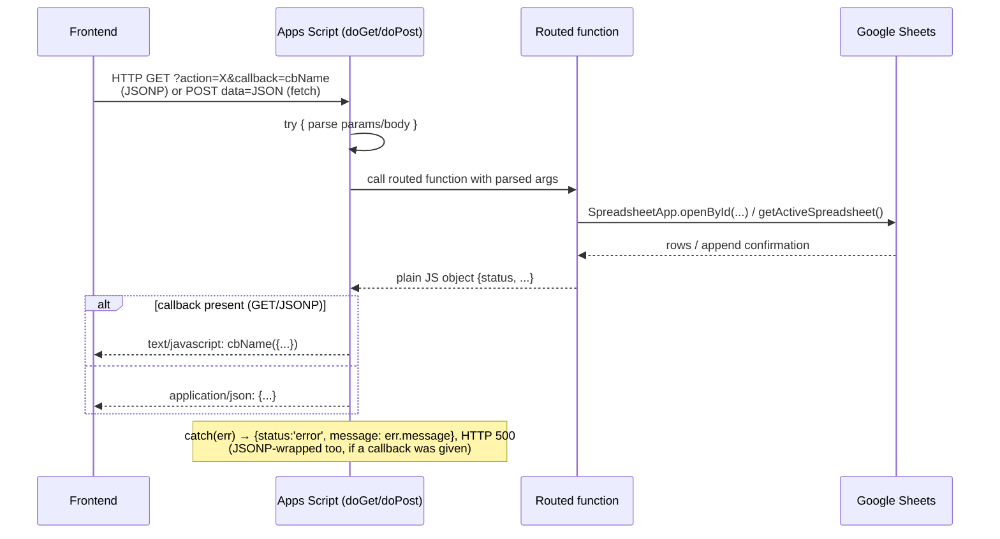

# Backend Flow

## Request lifecycle

Every request hits exactly one of two Apps Script entry points. There is no
router library — routing is a manual `if (e.parameter.action === '...')`
chain in `doGet`, and a `if (data.type === '...')` chain in `doPost`. See
`FUNCTION_MAP.md` for the full action → function table.

## Two transport patterns, and why both exist

**JSONP (GET + `<script>` tag injection)** is used for almost everything,
including several *writes* (`assign`, `grncreate`, `grnverify`,
`approve`, `reject`, `poShortfall`). This is because Apps Script Web Apps
don't reliably send CORS headers a plain cross-origin `fetch()` can read —
JSONP sidesteps CORS entirely since `<script>` tags aren't subject to it.
Every frontend page implements its own near-identical JSONP helper
(`jsonp()` in `grn-entry.html`/`grn-verify.html`, several near-duplicate
per-call functions in `arn-assign.html`, inline in `index.html`/
`request.html`) — this pattern is copy-pasted five times across the
codebase rather than shared.

**Plain `fetch()` POST** is used only for the original three write paths
(`index.html`'s default adjustment, `request.html`'s material request, and
`arn-assign.html`'s `postToBackend` — though that last one is dead code,
see `FRONTEND_FLOW.md`). `arn-assign.html`'s actually-used ARN write path
goes through JSONP (`action=assign`), not `postToBackend`. Only `arn-assign.html`'s
dead `postToBackend` explicitly sets `mode: 'no-cors'`; `index.html` and
`request.html` do not, which is flagged as a likely bug in
`KNOWN_ISSUES.md` §2.

## Sheet access patterns

Three distinct access styles appear, inconsistently:

| Pattern | Used for | Risk |
|---|---|---|
| `SpreadsheetApp.openById(SHEET_ID)` | Adjustment Log, Material Requests | None — explicit, safe regardless of script binding |
| `SpreadsheetApp.openById(GRN_REGISTRY_SHEET_ID)` | All GRN/PO functions | None |
| `SpreadsheetApp.openById(OVERHEAD_SHEET_ID)` | Dashboard functions **[Code.js only]** | None |
| `SpreadsheetApp.getActiveSpreadsheet()` | Master Item List, ARN Pending, Employees | Implicitly assumes the script is container-bound to the `SHEET_ID` spreadsheet specifically — never verified in code; see `KNOWN_ISSUES.md` §5 |

## Caching and locking

- **Caching:** only `getActivePOs()` caches (`CacheService.getScriptCache()`,
  5 minutes, key `'activePOs'`), explicitly invalidated by
  `reportPOShortfall()` so a shortfall report is reflected immediately.
  Every other read (`getMasterItemListForSearch`, `verifyGrnExists`,
  `findDuplicates`, `getEmployeeList`, etc.) does a full, uncached sheet
  read on every single call.
- **Locking:** `LockService.getScriptLock()` (30s timeout) wraps exactly two
  operations: the personal-purchase PRN-number generation inside
  `arnAssign`, and the entire `arnApprove` (ARN minting + Master Item List
  append + opening-stock log + status update). Everything else that
  generates a sequential ID (`getNextAdjSerial`, `suggestNextGrnFields`) or
  mutates a row (`arnReject`, `grnVerifyApprove`) does so **without** a
  lock — see `KNOWN_ISSUES.md` §6 for the race conditions this permits.

## Validation layers

Validation is split unevenly between frontend and backend, and is
**not mirrored** — some rules exist only client-side (easily bypassed by
calling the backend directly, e.g. via `curl`), others only server-side:

- **Frontend-only:** required-field checks before enabling submit buttons
  (e.g. "please select an item"), the client-side ARN suggestion engine's
  confidence scoring, the Procurement Request tab+number pairing rule in
  `arn-assign.html`.
- **Backend-only:** `appendRow`'s Inward-requires-`issuedTo`+`expiryDate`
  throw; `arnAssign`'s GRN-must-exist-in-registry check;
  `arnApprove`/`arnReject`'s requester-or-same-dept check; `grnCreate`'s
  exact-GRN+description duplicate check.
- **Both (duplicated, can drift):** the duplicate-item check in
  `arn-assign.html` (client debounce + server re-check inside `arnAssign`,
  correctly re-synced via `needsDuplicateAck`); required-field checks that
  exist as both a disabled-button state and a throw/`{status:'error'}`
  return (good defense in depth, at least these two are consistent with
  each other).

## Error handling shape

Every routed function returns a plain object; the convention is
`{status: 'success', ...}` or `{status: 'error', message: '...'}`, but this
is **not enforced by a shared helper** — each function builds its own
return object by hand, so the exact shape (extra fields like
`needsDuplicateAck`, `alreadyApproved`, `itemsSkipped`) varies per endpoint
and must be special-cased by whichever frontend function calls it. Thrown
exceptions inside `doGet`/`doPost` are caught at the top level and converted
to `{status:'error', message: err.message}` — but exceptions thrown by a
routed function **before** it returns (e.g. a `ReferenceError` from a
missing `Code.gs` symbol — see `KNOWN_ISSUES.md` §1) are still caught here,
so the frontend does get a JSON error response rather than a raw 500 — the
dashboard's "Could not load dashboard" message is what a user would
actually see if `Code.js` isn't part of the deployed project.

## Notification side effects (fire-and-forget, never block the write)

Every Slack/email call (`notifyPersonalPurchase`, `notifyGrnForVerification`,
`sendWeeklyPrnDigest`) is wrapped in its own try/catch, logging failures via
`console.error` but never propagating them — the underlying Sheet write has
already succeeded by the time these run, so a Slack outage or bad webhook
URL never causes a user-visible failure, only a silent notification gap
(invisible unless someone checks the Apps Script execution log).
