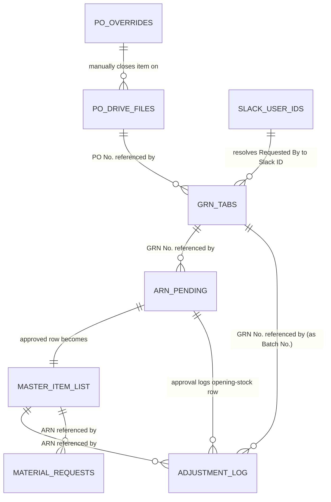

# Data Model

There is no database — every "table" is a tab in one of three Google
Sheets. Column positions matter: most backend code indexes rows by fixed
0-based array position (`row[8]`, etc.), not by header lookup, except in the
GRN Registry tabs, which use fuzzy header-matching (see `FUNCTION_MAP.md` →
`getGrnHeaderColumnMap`).

## Spreadsheet 1 — `SHEET_ID` (`1eWdZPo4pVclH0Av2558bghPJfnqeKe1PHmv98TjU_Qc`)

This is also the Apps Script **container-bound spreadsheet** (the only
spreadsheet accessed via `getActiveSpreadsheet()` rather than `openById`).

### Tab: "2. Adjustment Log"

21 columns (`COLUMNS` constant, `Code.gs` lines 19–41):

| Col | Header | Notes |
|---|---|---|
| A | Adj ID | `ADJ-####`, client-generated or server-generated via `getNextAdjSerial` |
| B | Date | `dd/mm/yyyy`-style, client-formatted |
| C | Time | client-formatted |
| D | ARN | monospace/blue styled |
| E | Item Name | |
| F | Dept | 2-letter code (`RD`/`MF`/`EN`/`GN`) |
| G | Unit | |
| H | Warehouse | |
| I | Adj Type | `Inward`/`Issue`/`Damage`/`Return`/`Recount`/`Transfer In`/`Transfer Out`/`Write-Off` |
| J | Quantity | |
| K | Effect | `+Add` / `-Deduct`, forced to text format (`setNumberFormat('@')`) so `-Deduct` doesn't get misread as a formula/negative number |
| L | GRN No. | reused as "Batch No." in some older field names (`d.batchNo`) |
| M | Reason | |
| N | Issued To | required for `Issue` and `Inward` |
| O | Project | required for `Issue` only |
| P | Manager Name | who logged the adjustment |
| Q | Status | hardcoded `'Logged'` on write; also reused as `'Approved'` for opening-stock rows from ARN approval |
| R | Approved By | only populated for opening-stock rows |
| S | Tally Sync | `'Not Synced'` default — no code anywhere sets this to `'Synced'`; likely updated manually or by an external Tally integration not present in this repo |
| T | Timestamp | ISO string, server-generated |
| U | Expiry Date | only for `Inward`; `'No Expiry'` literal string if the no-expiry checkbox was ticked |

### Tab: "6. Material Requests" (`getOrCreateRequestSheet`)

19 columns: `Request ID, Date, Time, ARN, Item Name, Dept, Unit, Warehouse,
Qty Requested, Purpose, Priority, Required By, Requester Name, Requester
Dept, Status, Issued On, Adj ID, Notes, Timestamp`. `Status` starts
`'Pending'`; `Issued On`/`Adj ID`/`Notes` are blank on write and presumably
filled in manually by stores staff once fulfilled — **no backend code ever
updates this sheet after the initial append**, and no frontend page reads it
back either. Effectively a write-only queue reviewed directly in Sheets.

### Tab: "1. Master Item List" (`MASTER_ITEM_SHEET`)

**Two header rows** — row 1 (title/section header) and row 2 (actual column
headers); data starts at row 3 (`for (let i = 2; ...)` in
`getMasterItemListForSearch`/`findDuplicates`, and `checkSetup()` reads row
2 as the header row). Column layout, reverse-engineered from every read/write
site:

| Col (0-based) | Field | Written by | Read by |
|---|---|---|---|
| 0 (A) | ARN | `arnApprove` | `findDuplicates`, `getMasterItemListForSearch`, `getNextAvailableArn` |
| 1 (B) | *(blank)* | — | — |
| 2 (C) | Material Name | `arnApprove` | `findDuplicates`, `getMasterItemListForSearch` |
| 3 (D) | Dept | `arnApprove` | `getMasterItemListForSearch` |
| 4 (E) | Sub-Category | `arnApprove` | — |
| 5–6 (F–G) | *(blank)* | — | — |
| 7 (H) | Brand | `arnApprove` | `findDuplicates` |
| 8 (I) | Unit | `arnApprove` | `findDuplicates`, `getMasterItemListForSearch` |
| 9 (J) | Purchase Price (unit price) | `arnApprove` (computed: amountPaid/qty, only if both present) | `checkSetup` (header-name sanity check) |
| 10 (K) | Stock / Initial Qty | `arnApprove` | `findDuplicates` |
| 11 (L) | *(blank)* | — | — |
| 12 (M) | Location / Warehouse | `arnApprove` | `getMasterItemListForSearch` |
| 13 (N) | Vendor | `arnApprove` | — |
| 14 (O) | Item Status | `arnApprove` (`'Active'`) | `findDuplicates` (flags `INACTIVE` in the UI) |
| 15 (P) | Type | `arnApprove` (`'goods'`, literal) | — |
| 16 (Q) | Date Added | `arnApprove` | — |
| 17 (R) | Source / Notes | `arnApprove` (free text describing GRN/PRN provenance) | — |

Columns B, F, G, L are never written by any code path in this repo —
either reserved for manual entry, legacy fields, or genuinely unused.

### Tab: "7. ARN Pending" (`ARN_PENDING_SHEET`)

27 columns (`ARN_PENDING_HEADERS`), self-healing header row (rewritten if it
ever drifts from this exact list):

`ID, Timestamp, Material, Brand, Qty, GRN No., Dept, Subcat, Requested By,
Notes, Status, Corrected Dept, Corrected Subcat, Rejection Reason, Unit,
Final ARN, GRN Status, Vendor, PO No., Duplicate Acknowledged, Amount Paid,
Bill / Invoice No., Paid By, Reimbursement Status, Procurement Request No.,
Requester Dept, Location`

`Status` values observed in code: `Pending` → `Approved` | `Needs
Correction`. `GRN Status`: `Confirmed` (normal GRN) | `Provisional`
(personal purchase, pending real GRN). `Reimbursement Status`:
`'Awaiting Reimbursement'` (personal purchase default; nothing in this repo
ever sets it to anything else — presumably updated manually in the sheet
once Accounts settles it, matching `sendWeeklyPrnDigest`'s comment
instructing exactly that).

### Tab: "Employees" (`EMPLOYEES_SHEET`, container-bound spreadsheet)

Single column, "Employee Name" — fallback source for `getEmployeeList()`,
used only if the GRN Registry's "Slack-user IDs" tab is missing/unreadable.

## Spreadsheet 2 — `GRN_REGISTRY_SHEET_ID` (`1y2R4eYeep0ZSY91QMxnLov1ZZU4geOgGBNsbWoVx9cY`)

### Category tabs (dynamic — any tab whose header row contains "grn no.")

No fixed tab list; `getGrnCategoryTabs()` discovers them at runtime. Columns
are matched **fuzzily** via `GRN_FIELD_HEADER_KEYWORDS` (23 canonical
fields) rather than by fixed position, because different category tabs use
slightly different header wording/spelling:

| Canonical field | Matches header containing | Notes |
|---|---|---|
| `slNo` | `slno` or `srno` | |
| `receivedDate` | `date` (excluding invoice/exp/verified) | |
| `invoiceNo` | `invoiceno` | |
| `invoiceDate` | `invoicedate` | |
| `poNo` | `pono` | |
| `requestedBy` | `requestedby` | drives the Slack `@mention` target |
| `inwardEntryNo` | `inwardentryno` | |
| `catalogueLotNo` | `catalogue` | |
| `grnNo` | `grnno` | matched exactly elsewhere too, via `findGrnColumn` |
| `partyName` | `nameoftheparty` | vendor |
| `materialDescription` | `descriptionofmaterial` | dedup key alongside `grnNo` |
| `quantity` | `quantity` | |
| `invoiceAmount` | `invoiceamount` or `invoicveamount` (typo tolerance) | |
| `receivedBy` | `receivedby` | |
| `issuedTo` | `issuedto` | note: `verifyGrnExists` separately also checks for a `"issued  to"` (double space) header variant |
| `receiptAcknowledged` | `receiptacknowledged` | never written by any code path — manual field |
| `zohoRemarks` | `zohoentry` or `ramarks` (typo for "remarks") | never written by any code path |
| `zohoEntryBy` | `zohoentryby` | never written |
| `notificationSent` | `notificationsent` | never written by any code path — likely meant to be manually ticked once someone confirms the Slack DM landed |
| `expDate` | `expdate` | |
| `basicAmount` | `basicamont` or `basicamount` (typo tolerance) | |
| `otherCharges` | `othercharges` | applies once per GRN No., not per item |
| `gst` | `gst` | may be a computed `"NNN (18% GST)"` string, see `formatGst` in `grn-entry.html` |

Plus two columns managed exclusively by the backend (appended automatically
if missing, via `ensureGrnVerificationColumns`): **Verification Status**
(`'Pending Verification'` → `'Verified'`), **Verified By**, **Verified
Date**.

### Tab: "Slack-user IDs"

Columns: some "display name" and/or "name" column, plus a column containing
Slack member IDs (format `/^[UW][A-Z0-9]{6,}$/i`, detected by shape rather
than a fixed column position). Doubles as the **primary source for the
employee directory** (`getSlackUserIdsTabNames`) across most of the app.

### Tab: "PO Manual Overrides" (`PO_OVERRIDES_SHEET`, auto-created)

5 columns: `PO No., Item Description, Reason, Closed By, Closed Date`.
Purely additive audit log — nothing in this repo ever reads it except
`getPOOverrideKeys()` (checked against every PO item to force
`remainingQty = 0` regardless of the arithmetic).

## Spreadsheet 3 — `OVERHEAD_SHEET_ID` (`1DNrFVaAb5EYtyU8qHrAwGrP8BcpR10IFIY4wGYIoylU`)

Feeds the executive dashboard only; populated by some external
process/import not present in this repo (the backend only *reads* these
tabs, never writes to them).

- **"Category Summary"** — row layout: a header row located by searching
  for literal `'Category'` in column A, followed by month columns, then
  `Total` and `% of Total`, terminated by a row literally labeled `'TOTAL
  OVERHEAD'`.
- **"Raw Data"** — ledger-line-level detail, at least a `Total` column;
  first column is the ledger name.
- **"CashOutflow Category Summary"** — same shape as Category Summary,
  terminated by `'TOTAL CASH OUTFLOW'` (or `'TOTAL OVERHEAD'` as a
  fallback).
- **"CashOutflow Vendor Detail"** — `Vendor`, `Category`, `Total` columns;
  a `Category` value of exactly `"Uncategorized"` is treated specially
  (excluded from "largest category," reported separately as a % gap).

## Google Drive — `PO_FOLDER_ID` (`1jg23hI1qSep_sslbUUr_wlimR0b07YeZ`)

Not a database, but functions as one for open-PO data: a folder of vendor
`.xlsx` files (`MimeType.MICROSOFT_EXCEL`), parsed live on every
(uncached-beyond-5-minutes) `getActivePOs()` call. Each file's structure is
located by searching cell values for labels (`"Voucher No."`, `"Dated"`,
`"Supplier (Bill from)"`, `"Sl"`) rather than fixed coordinates — see
`parsePOSheetValues`. There is no explicit schema/template file in this
repo; the parser's tolerance for layout variation **is** the schema.

## Cross-sheet relationships (conceptual ER sketch)

All of these "relationships" are **soft** — string matching (GRN No., PO
No., ARN, normalized item description) across independently-editable
sheets, with no referential integrity, no foreign keys, and no cascade
behavior. A typo or manual edit in any sheet silently breaks the link with
no error surfaced anywhere.
