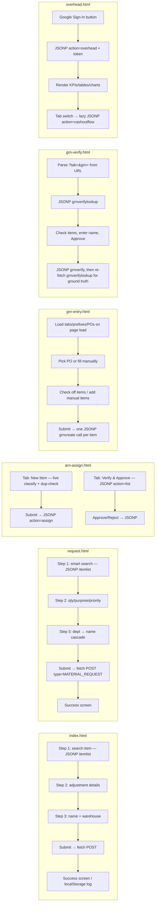

# Frontend Flow

Each page below is a standalone entry point (see `ARCHITECTURE.md` — there is
no shared navigation). All pages hardcode the same Apps Script Web App URL
(`APPS_SCRIPT_URL` / `CONFIG.WEBAPP_URL`) as a literal string constant, so
changing backend deployments means editing every HTML file individually.

## Page flow diagram (per-page internal flow; no cross-page flow exists)

## `index.html` — Inventory Adjustment

**UI:** 3-step card form (locked steps unlock as prior steps complete) +
recent-adjustments log (session-local, `localStorage`) + toast messages.

**On load (`init()`):** sets header date, restores `adjCounter` from
`localStorage`, renders recent log. Fires `loadEmployees()` and
`loadItems()` immediately (both JSONP, both fire on page load regardless of
user interaction).

**Step 1 — Select Item:**
- `searchInput` keyup → `search(q)` (simple case-insensitive substring match
  on ARN or name, capped at 40 results) → `renderDropdown`.
- Arrow keys / Enter navigate the dropdown (`ddActive`).
- `selectItem(idx)` populates the item card, unlocks steps 2–3, auto-fills
  warehouse from the item's last-known location.

**Step 2 — Adjustment Details:**
- `onTypeChange()` toggles Issue-specific fields (Issued To, Project) or
  Inward-specific fields (Restock Issued To, Expiry Date) based on the
  selected `adjType`, and auto-sets the Add/Deduct effect per type
  (`Inward`/`Transfer In`/`Recount` → add; everything else → deduct).
- `lookupGrnForRestock()` fires on GRN field blur, only for `Inward` — JSONP
  `grnlookup`, pre-fills "Issued To" from the GRN registry's own record if
  the field is still empty (never overwrites something the user already
  typed).
- `toggleNoExpiry()` disables/clears the expiry date field when "No expiry"
  is checked.

**Step 3 — Confirm & Submit:**
- `submitAdjustment()`: client-side required-field validation (item
  selected, type, effect, quantity>0, GRN No., reason, manager name, plus
  type-specific: Issue needs Issued To + Project, Inward needs Issued To +
  (expiry or No-expiry)). Builds the payload, POSTs via `fetch()` — **no
  `mode: 'no-cors'`** (see `KNOWN_ISSUES.md` §2). On success: increments
  local counter, prepends to `recentLog`, shows success screen. On
  `fetch()` rejection: shows a generic "Network error" toast and
  re-enables the button — **this can fire even when the write actually
  succeeded**, per the CORS issue above.

**Data rendered:** success screen detail rows (ARN, item, type, GRN,
quantity+effect, issue/restock-specific rows, logged-by, timestamp); recent
log (last 5, session-only, lost on `localStorage` clear or new device).

## `request.html` — Material Request

**UI:** 3-step card form, structurally identical to `index.html` but for a
request rather than a direct adjustment.

**Search:** more sophisticated than `index.html` — `smartSearch(q)` expands
common lab abbreviations/synonyms (`SYNONYMS` map: `bsa`, `edta`, `pcr`,
`hrp`, `fitc`, etc.) and scores results (exact ARN match highest, then
all-terms-present, phrase match, starts-with, substring), sorted descending,
capped at 50.

**Step 2:** quantity, purpose/project (free text), priority (Normal/Urgent
toggle buttons), optional "required by" free text.

**Step 3:** department dropdown (4 fixed options: `R&D`, `Manufacturing`,
`Corporate / Admin`, `Quality & Regulatory`) cascades to a name dropdown
populated from the **hardcoded** `EMPLOYEES` object (`onDeptChange`).

**Submit (`submitRequest()`):** same required-field pattern as `index.html`;
POSTs `type: 'MATERIAL_REQUEST'` — same missing-`no-cors` risk.

## `arn-assign.html` — ARN Assignment + Approval

Two independent panels, toggled by `.tab-btn` clicks — no page reload, no
URL change (so refreshing loses the active tab and any in-progress work).

### New Item tab

- Material name / brand inputs drive **two independent debounced side
  effects**: `runSuggestion()` (300ms, client-side-only classifier —
  `suggestArn()`, brand rules first, then keyword scoring across 22
  sub-categories, then a department default fallback) and
  `runDuplicateCheck()` (600ms, server round-trip via `dupCheckViaJsonp`,
  `action=dupcheck`).
- Duplicate warnings render matches from both the Master Item List and other
  pending requests; require ticking an acknowledgement checkbox
  (`f-dup-ack`) before submission is allowed if any matches were found.
- "Personal purchase" checkbox disables/repurposes the GRN field (becomes
  "auto-generated"), reveals vendor/amount/bill/paid-by fields.
- Procurement Request No. requires **both** a tab (`Common`/`R&D`/
  `Platform`/`MFG`/`Admin`) and a number, or neither — enforced client-side
  because the number alone isn't unique across the source spreadsheet's
  tabs.
- Submit (`btn-submit` click handler): client validation, then
  `assignViaJsonp(payload)` → `action=assign`. Handles a **second-chance
  duplicate check** from the server response (`needsDuplicateAck`) in case
  someone else submitted the same item in the seconds since the client's
  own check — re-renders the warning and re-prompts for acknowledgement
  rather than silently failing.
- On success: resets the form, appends to an in-session "Submitted this
  session" list (not persisted, lost on refresh).

### Verify & Approve tab

- Department + name dropdowns (from the same hardcoded `EMPLOYEES` object).
- "Load Pending Items" → `fetchPendingItems(person, dept)` → `action=list`.
- Each pending card: Approve button (`approveItem` → `action=approve`,
  replaces the card with the final ARN + a "Copy ARN" button using
  `navigator.clipboard`) or Send Back button (reveals a correction form:
  corrected sub-category dropdown + reason textarea → `rejectItem` →
  `action=reject`).

### Backend call helpers

All reads/writes from this page are JSONP (`dupCheckViaJsonp`,
`assignViaJsonp`, `fetchPendingItems`, `approveViaJsonp`, `rejectViaJsonp`),
each with a 10-second timeout and its own dynamically-created `<script>`
tag + `window[callbackName]`. The one write that goes through
`postToBackend()` (a plain `fetch`) explicitly sets `mode: 'no-cors'` — with
a code comment noting this avoids "the CORS-preflight issue that bit the
inventory app before," though that function (`postToBackend`) is defined but
**never actually called** anywhere in this file — `ARN_ASSIGN` submission
in practice goes through `assignViaJsonp`, not `postToBackend`. Dead code.

## `grn-entry.html` — GRN Entry

**On load:** fires `loadTabs()`, `loadEmployees()`, `loadActivePOs()`
concurrently.

**PO linkage:** selecting a PO from `f-po-select` auto-fills PO No. and
vendor, switches the material-entry UI from free-text fields to a
per-item checklist (`activePOsData[idx].items`, filtered to
`remainingQty > 0` — fully-received items aren't shown). Each checked item
has its own editable quantity/basic-amount/GST fields (defaulting to the
item's remaining balance, not the original order quantity). A "Report
shortfall" link appears per item that already has partial receipts,
prompting for a reason + name (plain `prompt()` dialogs) and calling
`action=poShortfall`.

**No-PO / manual path:** supports multiple hand-typed line items
(`addManualItemBlock()`/"+ Add another item"), each with its own
description/quantity/invoice-amount/basic-amount/GST, all sharing one GRN
No. on submit.

**Ad-hoc item:** a checkbox to add one extra item alongside a selected PO's
checked items (substitution/free sample) — saved with a `[Not on PO]`
description prefix.

**GRN identifiers:** category/tab select drives `loadPrefixesForTab()`
(dropdown of historically-used prefixes for that tab, or a free-text
fallback if the tab has no history) and `refreshSuggestions()` (Sl No. /
GRN No. suggestions, only overwriting empty fields unless forced by the
"Re-suggest" button or a tab/prefix change).

**GST helper (`formatGst`):** if typed as a percentage (`"18%"`), computes
the rupee amount from that item's Basic Amount and appends `"(18% GST)"` for
readability in the sheet; otherwise passed through as typed.

**Date handling (`toDDMMYYYY`):** converts the native `<input type=date>`'s
ISO output to `dd/mm/yyyy` before submission, to match the rest of the
sheet's date formatting.

**Submit:** builds one payload per line item (from checked PO items, or
manual blocks, or the ad-hoc item — any combination), requires at least one
item, then sends them **sequentially** (`for...of` + `await`) as separate
`action=grncreate` JSONP calls sharing the same GRN No. Reports
partial-success (some items saved, some failed) distinctly from total
failure.

## `grn-verify.html` — GRN Verify

**On load:** reads `tab`/`grn` from the URL query string; if either is
missing, shows "this link looks incomplete" without calling the backend.
Otherwise `loadDetails()` (JSONP `grnverifylookup`) and `loadEmployees()`
(JSONP `employees`, for the name field's datalist).

**Rendering:** shows PO/vendor/invoice/received-date/requested-by once
(shared across all items under this GRN), then one block per line item with
a checkbox (pre-checked; already-`Verified` items show a badge instead of a
checkbox and can't be re-approved). If every item is already verified, the
Approve button is disabled and a "already verified by X" message shown.

**Approve:** requires a name; requires at least one item checked (if any
checkboxes exist at all). Sends `action=grnverify` with the selected item
descriptions as a JSON array. **Always re-calls `loadDetails()` afterward**
regardless of what the write response said, and derives the success/failure
message from that fresh read rather than the original response — explicitly
designed (per its own `FIX:` comment) to avoid showing a false failure
message when the write actually succeeded but the response was lost/garbled
in transit.

## `exec-dashboard/overhead.html` — Financial Dashboard

**Gate:** Google Identity Services sign-in button; `handleCredentialResponse`
sends the raw ID token to the backend rather than trusting any client-side
decoding.

**On successful auth:** hides the gate, shows the dashboard shell, renders
KPI cards, a category breakdown table, a stacked bar chart (category ×
month, Chart.js), a donut chart (share of total), and a top-5-ledger-lines
table — all from one `getOverheadSummary()` payload.

**Cash Outflow tab:** lazy-loaded only on first click
(`window.__cashoutflowLoaded` guard) using the **same cached ID token**
(`window.__lastToken`) rather than re-prompting sign-in — reuses the token
across both dashboard actions within the session.

**Sign out:** `google.accounts.id.disableAutoSelect()` + full page reload —
no server-side session to invalidate (there isn't one; every request
re-verifies the token).

## `exec-dashboard/overhead-auth-test.html` — Auth Test Harness

Renders the same sign-in button; decodes the JWT **entirely client-side**
(manual base64url decode, no signature check) and compares the email
against a locally-duplicated allowlist, purely to smoke-test that sign-in
+ email extraction works. Never contacts the Apps Script backend. Its own
comment explicitly disclaims this as a real security boundary.
